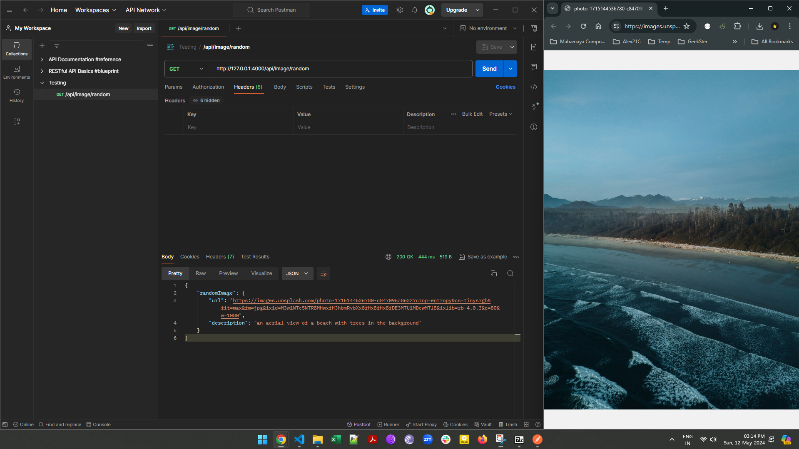
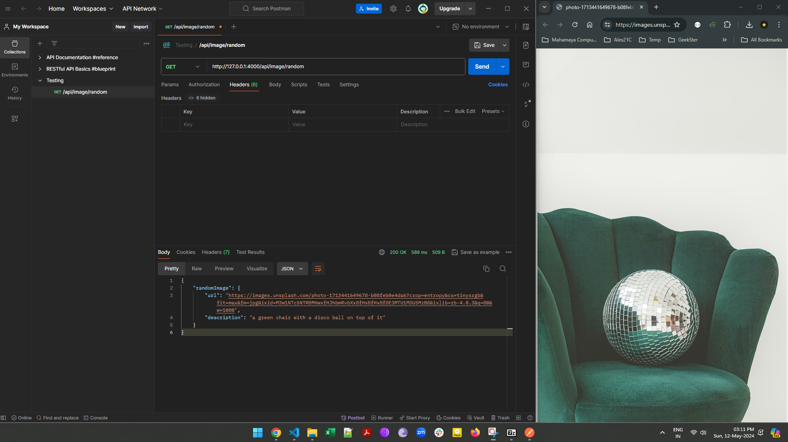
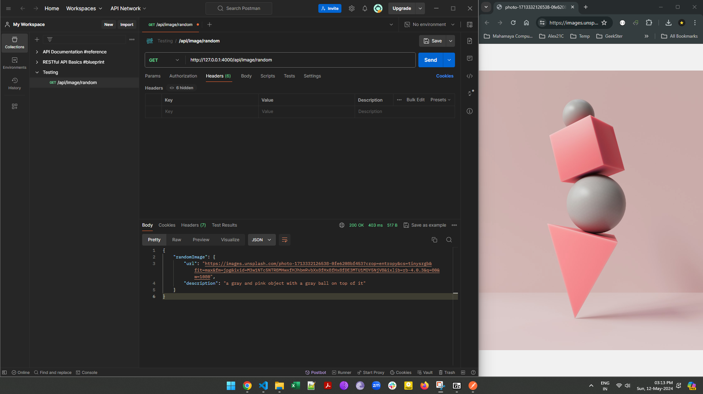

# Random image API (Day 5 Homework, Module #6, NodeJS)


## Description:
In this assignment, i have created a Random Image API using Node.js, a popular runtime environment for executing JavaScript code outside of a browser. This project help me understand backend development, APIs, and the Express.js framework.

## Objective:
The objective of this assignment was to gain hands-on experience in building a simple RESTful API that generates random Image. Through this project, i have learnt the fundamentals of setting up a server, defining routes, and handling HTTP requests and responses.

## Key Learning Objectives:
+ Understanding the basics of backend development with Node.js.
+ Exploring the Express.js framework for building web applications and APIs.
+ Implementing RESTful routes to handle different types of requests.
+ Generating random data and integrating it into an API response.
+ Testing the API endpoints using tools like Postman.


## How execute express server on yours local machine
### Step #1 : Configure .env file 
YOU Need to have .env file with [unsplash](https://unsplash.com/) API key access key
```javascript
UNSPLASH_ACCESS_KEY="YOURS_UNSPLASH_ACCESS_KEY"
```
### Step #2 git terminal installation
```bash
git clone https://github.com/Alex21c/m6node-day-5-homework-random-image-api.git
npm i
node index.mjs
```

### Step #3 Making request via yours browser or [postman](https://www.postman.com/)
on localhost, express.js server shall be running at port 4000
```javascript
http://127.0.0.1:4000/api/image/random
```

## API End Points
```javascript
GET /api/image/random
```
When a GET request is made to ```api/image/random```, the server will respond with a randomly generated image from [unsplash](https://unsplash.com/)

## API Response Example
return an JSON object containing random image URL and description.
```javascript
{
    "randomImage": {
        "url": "https://images.unsplash.com/photo-1715144536780-c847096a8632?crop=entropy&cs=tinysrgb&fit=max&fm=jpg&ixid=M3w1NTc5NTR8MHwxfHJhbmRvbXx8fHx8fHx8fDE3MTU1MDcwMTl8&ixlib=rb-4.0.3&q=80&w=1080",
        "description": "an aerial view of a beach with trees in the background"
    }
}
```

## Demo using [postman](https://www.postman.com/) and google chrome web-browser
### Making API Request #1

### Making API Request #2

### Making API Request #3


## Tech. Stack Used:
+ [NodeJS](https://nodejs.org/en/)
 
## Author
[Abhishek kumar](https://www.linkedin.com/in/alex21c/), ([Geekster](https://geekster.in/) MERN Stack FS-14 Batch)


  
  


